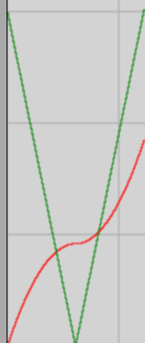

# Phisics-Engine

This repository is going to implement a simple physics engine for 2D point
mechanics. I am going to use the
[Euler-Richardson algorithm](https://www.physics.udel.edu/~bnikolic/teaching/phys660/numerical_ode/node4.html)
(RK2) for simplicity. The simple animation is going to go on the browser canvas.
The project is going to be part of a mathematics-physics training project for
elementary and secondary school pupils.

## Content

1. [Quick Start Guide](#quick-start-guide)
2. [Sign Up](#sign-up)
3. [Log In](#log-in)
4. [Create Project](#create-project)
5. [Execute Project](#execute-project)
6. [Numeric Results](#getting-numeric-results)
7. [Time Graphs](#getting-time-graphs)

## Quick Start Guide

I recommend first to create an account with your email address form the
[Sign Up](#sign-up) menu. Without creating an account, you still can try the
projects and even modify them, but the modifications are local to your computer.
You also don't get refreshed when someone modifies their projects, unlike with
an account, because the projects get updated whenever you [Log In](#log-in).

After registration, you need to verify your email and you ready to execute the
already existing projects or create your own ones. You are also able to publish
your projects and share them with other members.

To [execute a project](#execute-project) you need to go to the home page, where
you can navigate between projects with the **Next** and **Back** buttons. Chose
your project by clicking on its link then when the page loaded press the
**Start** button. You will see an animation, which is the physics simulation.
You may see the elapsed time and energy values at top-right corner of the
animation window and you can stop it and reset, by the appropriate buttons.

The simulations use metric units (m, kg, s, N, J, etc.) for normal simulations
and astronomical units for the celestial mechanics simulations, which show
planetary orbits around the Sun. For these simulations the unit of time is year
and the unit of distance is the astronomical unit, which is the Sun-Earth mean
distance (about 150 000 000km). The mass unit is the mass of the Sun. In these
units the gravitational constant in Newton's gravity law is about $4\pi^2$ .

You can also see a bunch of check-boxes, which control what it shows in the
animation window. You can turn off/on the time and energy values in the
top-right corner, the unit grid, the force vectors on the bodies and the
trajectories of the bodies.

You can get [numerical results](#numerical-results) by ticking the **Results**
checkbox and you are also able to get [time graphs](#time-graphs) by ticking the
**Graphs** checkbox. The app is able to show 4 different graphs on one page.
First you need to pick the maximum 4 different quantities from the numerical
results by choosing them with the selector and ticking the **Added to graphs**
check-box. You can remove them from the graph from the similar way with
unticking the checkbox.

After the selection, you need to tick the **Graphs** check-box and run the
simulation by clicking the **Start** button. The graph slowly appears as the
time elapses.

To [create a project](#create-project) you need to click the **Create** menu in
the top navigation and it opens the page. Here you can edit the current project
or press the **Create** button to create a new one. This leads to an empty world
with some predefined values, which are appropriate for most normal simulation
projects.

You can create new points from the points part with the New button and delete
them with the Delete button. All the points have an associated number (index)
and changing that, we can navigate between the mass points (bodies). We can also
edit the parameters of the point, with the given index. The **Point fixed**
checkbox creates fixed points, which cannot move at all.

The coordinates are in length units and the top-left corner of the simulation
window is always the origin. When the x position is growing the point moves to
the right, when y is growing it is moving down. The gravity of Earth is pointing
down to the y direction.

> **Caution:** The default value for g is 0, so there is no gravity. You must
> give the 9.8 parameter for g for normal simulations.

The rod is a stiff spring. You can create them by the **New** button delete them
by the **Delete** button, similarly to points. You can adjust the stiffness and
dumping of these. You also need to specify the indexes of the end points, which
the rod connects. All rods have their own index and by ticking the **Is spring**
checkbox the graphics will remind for a spring during the simulation.

From these elements you can build complex simulations. You can also create
periodic force, which effects some point to simulate resonance phenomenons. The
frequency of this force can be adjusted between the minimum and maximum value by
the range input on the project page meanwhile you are executing the simulation.

At the end give a name to the project and a short text description mainly for
accessible users, who may not be able to see the animations. Do not forget to
press the **Save** button to save the new project.

You can publish your project for the other registered users with ticking the
**Published** checkbox.

> **Caution:** You may get error messages if you are not logged in. The browser
> still saves into local storage, but this gets overwritten if you log in to
> your account.

### Sample Project I

The period of the mathematical pendulum is independent of its amplitude for
small amplitudes. What is happening to the period if the amplitude grows and not
small at all?

To answer this question and practice a bit all of the above, I will make a
sample project. We will make two mathematical pendulums, which can hang
independently and we can show and compare their x position, depending the time.
This way we can answer the question.

1. Let's log in to our account.
2. Create a new project (Navigate to create page, press **Create** button)
3. Do not forget to set g to $9.8m/s^2$
4. Create a fixed point to hang the pendulum(s) at x=3m y=0 position (Press
   **New** at points, tick **Fixed point** checkbox, fill in x and y)
5. Create a mass point at the x=3m y=3m position and let's give it vx=0.1m/s
   vy=0 initial velocity. The m should be 0.1kg (Similar like previously without
   ticking the checkbox)
6. Connect the two points (index=0 and 1) with a new rod (Press **New** button
   at rods, make sure elasticity = 10000, beta=100, point1 is 0 and point2 is 1
   and length=3m, the **Is spring** checkbox is unticked)
7. Fill in the title and text description and press **Save** button
8. Run it (Navigate to project page, press **Start**) It should be hanging
   nicely with tiny amplitude
9. Press **Stop** button and navigate back to the create page
10. Create another mass point at x=3m, y=3m position with the same m=0.1kg mass.
    This has index 2. The vx=5m/s vy=0 are the initial velocity.
11. Add another rod, which connects the points with 0 and 2 indexes. So
    point1=0, point2=2, elasticity=10000, beta=100, length=3m.
12. Run it again the same way like in 8. The two pendulum is not hanging
    perfectly synchronously.
13. Press **Stop** button and tick **Results** checkbox
14. New surface appears, navigate to point index 1, choose x position and tick
    **Added to graphs** checkbox
15. Do the same like in 14. but this time with point index 2
16. Press **switch back** button to make this surface disappear
17. Press **Reset** button to reset the simulation
18. Tick the **Graphs** checkbox
19. Press **Start** button, the graph should appear slowly. It's clear from the
    graph that the pendulum with the large amplitude has slightly bigger period.
    This answers the question, so the period of the mathematical pendulum grows
    with the amplitude.

### Sample Project II

There is a 0.1kg mass point, which can slide on a horizontal surface. It starts
in a rest position. There is a 1N constant horizontal force accelerates it for
1s then the friction slows it down until it stops. How much is the achieved
speed at the acceleration? How long is the path until it achieves this speed?
How long it takes the friction to stop the mass point again? How far the mass
point gets from the starting point? The friction coefficient is 0.3.

Let's solve the problem with a calculation first. The normal force balances the
gravity:/

$$
N = mg = 0.1kg\times 9.81m/s^2 = 0.981N
$$

The friction force:/

$$
F_f = \mu \times N = 0.3 \times 0.981N = 0.2943N
$$

The accelerating force:/

$$
F = F_c - F_f = 1N - 0.2943N = 0.7057N
$$

The achieved speed:/

$$
v = \Delta v = a \times t = F/m \times t = 0.7057N/0.1kg \times 1s = 7.057m/s
$$

The length of path at acceleration:/

$$
s_1 = \frac {a}{2} t^2 = 7.057m/s^2 /2 \times 1s^2 = 3.5285m
$$

The deceleration from friction:/

$$
a = \frac {F_f} {m} = \frac {-0.2943N} {0.1kg} = -2.943m/s^2
$$

The elapsed time until stop:/

$$
t = \frac {\Delta v} {a} = \frac {-7.057m/s} {-2.943m/s^2} = 2.3979s
$$

The length of path during deceleration:/

$$
s_2 = v_0t +\frac {a} {2} t^2 = 7.057m/s \times 2.3979s + \frac {-2.943m/s^2} {2} \times (2.3979s)^2 = 8.4610m
$$

The full path:/

$$
s = s_1 + s_2 = 3.5285m + 8.461m = 11.9895m
$$

Let's make the project:

1. Create project (go to create page and press **Create** button)
2. Add title and short description and save it (press **Save** button)
3. Add 9.81 to g
4. Change scale to 0.025, dt to 0.000001 and anim time to 0.003333333333333333
5. Make a fixed point at x=0, y=3 (Click **New** button at Points and input the
   coordinates then tick **Point fixed** checkbox)
6. Make a fixed point at x=15, y=3 (Do the same as in 5, but x=15)
7. Make a rod between points 0 and 1 (Click **New** and rods, make sure that
   length is 15 and point1 is 0 and point2 is 1. Also make sure that elastic
   constant is 10000 and beta 100)
8. Make a sliding point at x=0, y=2.9. m=0.1 and it is not fixed. (Press **New**
   at Points then give all the details and make sure the **Point fixed**
   checkbox is unticked)
9. Turn on point-rod collisions and add friction (tick the **body-rod collisions
   on** checkbox and add 100 value point-rod coll. beta. You also add 0.3 to
   point-rod coll. mu)
10. Create a 1N constant external force, which effects the 2nd point for 1s (Set
    the following data in periodic external force: point = 2, t min = 0, t max =
    1, freq min = 0, freq max = 0, F0x = 1, fix = 1.570796, F0y = 0, fiy = 0
    then tick the **Is on** checkbox)
11. Tick the **show time**, **show grid**, **show force** and **show energy**
    checkboxes to visualize data in simulation window
12. Run the simulation (navigate to project page and press **Start** button)
13. You can see that the point gets to rest after about 12m horizontal movement,
    which takes about 3.5s. Check this exactly. (press **Stop** when the sliding
    point is in rest, choose point 2, you can see x or path length is 11.9805 in
    exact agreement with our calculations)
14. Make t graphs of x, vx, ax od point 2 and Fx from periodic external force.
    (Press **Stop** then **Reset** buttons. Tick **Results** checkbox. Choose
    point 2. Pick x and tick **Added to graph** checkbox. Do the same with vx
    and ax. Choose periodic external force. Choose Fx and tick **Added to
    graph** checkbox. Tick the **Is origin centered** checkbox. Press **switch back** button. Tick **Graphs** checkbox and
    press **Start** button) You can see the above graphs slowly appear.

### Sample Project III\*

> **Caution\*** This project is for people, who know well the basic
> trigonometry.

There is an incline, which has 30degrees with the horizontal direction. How far
the mass point goes on the incline when its initial speed is 3m/s? How high it
gets when it turns back? How much is the magnitude of its acceleration and the
sum of the forces effect it? How much is the normal force? The friction is
negligible and the mass of the point is 0.1kg.

Let's first do a calculation and we can verify it by a simulation. The sum of
forces is:\

$$
F=mgsin\alpha
$$

In this case it's:\

$$
F = 0.1kg \times9.81m/s^2\times sin 30=0.4905N
$$

The magnitude of acceleration:\

$$
F = ma
$$

$$
a=F/m=0.4905N/0.1kg=4.905m/s^2
$$

The time of deceleration is the same as the time of acceleration, so\

$$
a = |\Delta v|/t
$$

$$
t=|\Delta v|/a=v/a=\frac{3m/s}{4.905m/s^2}=0.61162s
$$

The length of path during this time\

$$
s=a/2\times t^2 = 4.905m/s^2/2\times (0.61162s)^2=0.9174m
$$

The achieved height is\

$$
h = s\times sin\alpha = 0.9174 \times 0.5 = 0.4587m
$$

We should get these details from a simulation too. Let's make the simulation.
The first endpoint of the incline will be x0=1m and y0=3m. Let's choose the
length of the incline l=2m. Let's calculate the other endpoint:\

$$
x_1 = x_0 + l\times cos\alpha = 1m + 2m \times cos 30 = 2.732051m
$$

$$
y_1 = y_0 -l\times sin\alpha = 3m - 2m \times sin 30 = 2m
$$

Now we calculate the position of the mass point at the start, when its radius =
0.1m.\

$$
x_2 = x_0 - r \times sin\alpha = 1m - 0.1m\times sin30 = 0.95m
$$

$$
y_2 = y_0 - r \times cos\alpha = 3m - 0.1m\times cos30 = 2.9134m
$$

We also need to calculate the component of the initial velocity:\

$$
v_x = v_0 \times cos \alpha = 3m/s \times cos 30 = 2.598076m/s
$$

$$
v_y = v_0\times sin\alpha = 3m/s\times sin30 = 1.5m/s
$$

Now we have all the details for making the simulation.

1. Create a new project (Choose **Create** menu at top bar then press **Create**
   button)
2. Add 9.81 to g
3. Press the **New** button at points to create the bottom point of the incline.
   Set x=1 and y=3 then tick **Point fixed** checkbox.
4. Press the **New** button again to create the top point of the incline. Set
   x=2.732051 and y=2 then tick **Point fixed** checkbox again.
5. Now press the **New** button at rods to create the actual incline. Make sure
   it has point1=0 and point2=1, so it connects the previous points. The
   length=2 and elasticity=10000 and beta=100.
6. Press **New** button again at points to create the sliding mass point. Set
   m=0.1 x=0.95 y=2.9134 and tick **Is path visible** checkbox to show the path.
   Set vx=2.598076 and vy=-1.5. vy must be negative, because the point goes up
   but y grows downwards.
7. Name the project and write a short text description.
8. Tick the **show time**, **show grid**, **show force** and **show energy**
   checkboxes to see more data during the simulation.
9. Do not forget to tick the **body-rod collision on** checkbox. This makes
   sure, that the point won't ignore the incline, so the system calculates the
   forces between them. Make sure that **collision k** parameter is 10000 and
   **point-rod coll. beta** is 100. These are the elasticity and damping
   constants of the collision between the rod and the mass point.
10. Click the **project** link in the top bar and the **Start** button to run
    the simulation. It runs quite fast.

> **Tip** The project runs quite fast, but we can slow it down by changing the
> **dt** and **anim time** parameters in the same ratio. If for example we
> choose dt=1e-7 and anim time=0.0003333333333 it slows down everything 100
> times. We should keep the ratio of these parameters the same as the original
> setup was.

11. Now we can get some graphs. Press **Stop** button and **Reset** button then
    tick the **Results** checkbox.
12. Choose index 2 for the point then select **path length** and tick **Added to
    graphs** checkbox.
13. Select **v** then tick **Added to graphs** checkbox again
14. Click **switch back** button and tick **Graphs** checkbox then click the
    **Start** button to get the graphs. We get the below graph:

The red curve is the path length, which changes very slowly around the time,
when the body turns its direction of movement. The green v-shaped line is the
speed. It goes down to zero and up when the body goes back to its original
position. The turning point is when v=0. We see that the values, what we can
read from the graph are in consistency with our calculation, although graph
readings have limited accuracies.

15. Untick the **Graphs** checkbox then press **Reset** and **Start**
16. Press **Stop** when the time is 0.611 roughly
17. Tick **Results** checkbox and choose 2 for point index. The sliding point is
    red now, which means it's selected and we can see its numerical values.
    Thepath length=0.9174, a=4.905 and v is nearly 0 in full agreement with our
    calculations. We can read y=2.4548.

/

$$
h=|\Delta y| = |y - y_0| = |2.4548 - 2.9134| = 0.4586m
$$

This is again in full agreement with our calculations.

## Sign Up

You can create an account from here, if you do not have one. You just need to
fill in a form. You need a valid email address, because you will receive a
verification email and you need to click on the link to verify your email
address. The form to fill in has the following fields: email, password, confirm
psw, first name, last name. The first and last names are optional.

## Log In

> **Caution** When you are logged in, but getting access denied errors, the
> validity of your token has expired. In a case like this you must log out at
> the home page and log in again.

The form has the email and the password fields. You also can get to the sign up
page from here if you don't have an account yet. At successful login you get a
confirmation with a button, which redirects you to the home page. There is a
link, for the case you have forgotten your password. It will send you an email
with a link, which makes you possible to make a new password.

## Create Project

Creating simulation projects means that we specify the general simulation
parameters and the initial conditions of all the points and rods, which build up
the simulations. Rods are very stiff springs. What kind of forces do we have?

1. **Gravity** It's the force, which pulls downwards each bodies close to the
   surface of the Earth. This is the force we calculate with the formula
   $F_g = m \times g$ and this force always points downwards, which in our
   simulations the y direction. We can adjust the value of g as a general
   parameter. For celestial mechanics simulations there is an attracting force
   between each pair of bodies, which we calculate with Newton's formula:
   $F_g = G \frac{m_1m_2}{r^2}$ In this formula $m_1$ and $m_2$ are the masses
   and r is the distance between them. The units are astronomical units, so
   $G=4\pi^2$, the distance unit is the Sun-Earth medium distance (150 000
   000km) and the mass unit is the mass of the Sun. The time unit is the year.

> **Caution** For celestial mechanics simulations you have to choose celestial
> mechanics for **simulation type**. The default value is normal simulation,
> which means experiments either in no gravity or close to the surface of the
> Earth as we have all got used to it.

> **Caution** For celestial mechanics simulations you may need to specify the
> appropriate force multiplier. The number of the force in astronomical units
> can be tiny, like 5e-5, so we need to multiply it to make it visible when you
> try to visualize it in the simulation or graph.

2. **Elastic and dumping forces** between points, which are connected by a rod.
   The rod follows Hook's law. $F_e = -k \Delta l = -k \times (l - l_0)$ The
   force is proportional with the deformation, the k constant is the elastic
   constant. The minus sign expresses that the elastic force tries to decrease
   the deformation. The damping force is a velocity dependent force, which
   depends on the relative velocity of the end points. If this relative velocity
   has parallel component by the rod, the damping force is $F_d = -\beta v_r$,
   where $\beta$ is the damping constant, $v_r$ is the relative velocity
   component, parallel with the rod. The minus sign expresses that its direction
   is so that it always decreases the relative velocity component.
3. **Collision forces** You can allow collisions between points and between
   points and rods. In both cases we imitate the collision force with elastic
   force. This is how we deal with the normal force on inclines for example.
   There is dumping on the calculation of these forces too.
4. **Friction forces** If you specify more than 0 for the $\mu$ (mu) either for
   point-point collisions or point-body collisions, we have the Coulomb-model of
   friction forces. The friction force is trying to decrease the relative
   velocity, so it points to the opposite direction and parallel with the
   surface (tangential direction). If the relative velocity is zero, we get
   static friction. The static friction can be calculated from the condition
   that the relative acceleration is zero, so the net force should produce the
   acceleration, which the surface point, If the friction is dynamic, the value
   of the force is $F_f = \mu \times N$ In this formula N is the normal-force
   and $\mu$ is the friction coefficient, which is usually maximum 1. The value
   depends on the surfaces mainly, both the materials and the smoothness of the
   surface effects it.
5. **Periodic External Force** We can also add some periodic external force to
   effect one point. This is mainly useful to check resonance phenomenons. This
   force starts at some point in time and stops at a later point in time. We
   define it by its components, like the following formulas: /

$$
F_x = F_0,_x sin (\omega t + \phi_x)
$$

$$
F_y = F_0,_y sin(\omega t + \phi_y)
$$

$$
\omega = 2\pi f
$$

Here f is the frequency, which is between the min and max values and it can be
adjusted real time with a range input, when you run the simulation.

> **Tip** You can add a constant force to a point for a certain amount of time,
> because f can be zero and the phase factors can make the sin functions 1.

6.**Air resistance** You can add air resistance to the points with specifying
the drag coefficient above 0. It's usually 0.47 for spherical bodies under
normal circumstances. The force, effecting the spherical bodies, is /

$$
F_d = \frac {1} {2} \rho v^2 C_d A
$$

$C_d$ is the drag coefficient, usually 0.47 for smooth spheres, although it
changes for very high speeds or very low speeds. It also depends on the shape of
the bodies, hence the car can be designed to have a low drag coefficient to
reduce air resistance. A is the area what the flow "sees", so for a sphere it's
$A = R^2 \pi$ if the radius is R.

The forms, can be used to define the simulation parameters, the mass points or
the rods are pretty straightforward. You need to specify all the points and rods
for the simulations. The forms also specify the above parameters and the initial
conditions. For celestial mechanics rods are not necessary, because the only
important force between the points is gravity.

We still have to mention the **Copy** and **Delete** buttons, beside the
**Save** and **Create** buttons. With the **Copy** button, we can copy an
existing project as our own to modify it. The **Delete** button can delete our
projects.

## Execute Project

You navigate to the project page and press the **Start** button. You can also
stop or reset the project with the relevant buttons. The **Zoom In** and **Zoom
Out** buttons can zoom in and out of the world view, although the origin of the
coordinate system stays in the top-left corner. We can turn on and off some
visualisations with the checkboxes, like **Grid**, **Time**, **Force** and
**Energy**. The **Graph** checkbox changes the view to show the graphs instead
of the simulation. The **Results** checkbox is used to show a piece of UI, which
shows all the important numerical results and you can also pick the quantities
you can see on the graphs. 

## Numeric Results

You normally stop the project by clicking the **Stop** button and tick the
**Results** checkbox. This opens up a piece of UI, where you can pick an element
of the simulation (a point or a rod) or you just get an overview of the
simulation parameters, like time or g. 
Whatever element you select, it's going to be red in the simulation view. You
can also view the collision and friction forces regarding the selected element.
On the image, we can see the [Sample Project II](#sample-project-ii) numeric
results. The rod (incline) and its collision with the 2nd point (the sliding
one) has been chosen. We can read the N (normal force) and the F (friction
force).

## Time Graphs

When you go to the [Numeric Results](#numeric-results) you can choose maximum 4
parameters, which can be shown as the function of time on a graph. These can be
anything available on the select element, like the x coordinate of the 5th point
or the acceleration of the 6th point. It also can be the periodic external force
or the normal force between the 0th rod and the 2nd point. When you have chosen
the parameters, you can view the graphs by pressing the **switch back** button
and tick the **Graphs** checkbox. This makes the animation disappear in the
simulation window. If you press the **Start** button, you see the graphs
gradually appear as the simulation progresses. The origin is the bottom-left
corner, we can magnify by the **Zoom In** and **Zoom Out** buttons, but we
cannot change the position of the origin, unless we tick on the results page the
**Is origin centered** checkbox. This centres the origin on the y axis, so we
can see if a parameter negative.

> **Caution** The path is not going to be recorded when the simulation is
> drawing the graphs. If you untick the **Graphs** checkbox you will see
> inaccurate paths. You must reset and rerun the simulation to see the correct
> paths.
